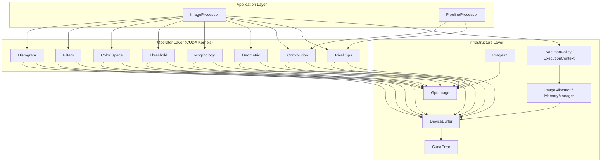
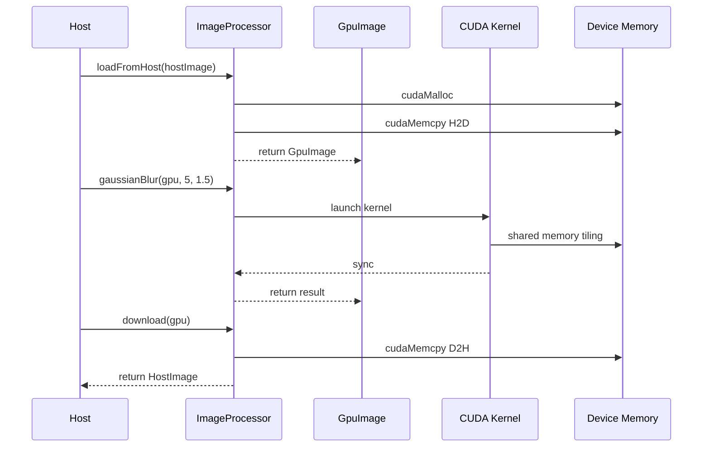
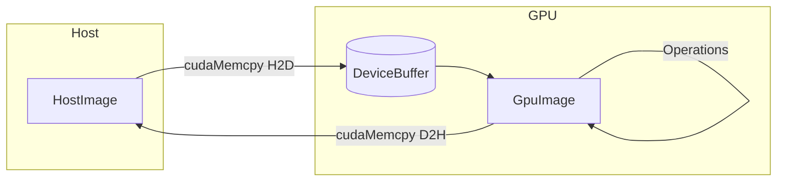

# Architecture Overview

Mini-OpenCV uses a **three-layer architecture** designed for performance, modularity, and ease of use.

## Three-Layer Design



## Layer Responsibilities

### 1. Application Layer

The top-level API that users interact with:

| Component | Purpose |
|-----------|---------|
| `ImageProcessor` | Main entry point for image operations (holds an `ExecutionContext`) |
| `PipelineProcessor` | Multi-stream batch pipeline built from user-defined steps (`addStep` + `processBatch`) |

### 2. Operator Layer

CUDA kernels implementing image processing algorithms. All operators are static functions that take an optional `cudaStream_t`:

| Category | Operations | CUDA Technique |
|----------|------------|----------------|
| **Pixel** | Invert, grayscale, brightness | Per-pixel parallelism, `uchar4` vectorization |
| **Convolution** | Gaussian blur, Sobel, custom kernels | Shared memory tiling |
| **Histogram** | Calculation, equalization | Shared-memory atomic histogram + block merge |
| **Geometric** | Resize, rotate, flip, affine | Nearest-neighbor / bilinear interpolation |
| **Morphology** | Erosion, dilation, open/close | Custom structuring elements |
| **Threshold** | Global, adaptive, Otsu | Histogram-driven |
| **Color Space** | RGB/HSV/YUV/Lab conversion | Per-pixel color transforms |
| **Filters** | Median, bilateral, sharpen | Edge-preserving filters |

### 3. Infrastructure Layer

Core utilities for GPU computing:

| Component | Purpose |
|-----------|---------|
| `DeviceBuffer` | RAII GPU memory management |
| `GpuImage` / `HostImage` | Image containers (device / host) |
| `ExecutionPolicy` / `ExecutionContext` | Sync / Async / Batch execution model wrapping a CUDA stream |
| `ImageAllocator` / `MemoryManager` | Output allocation with optional memory pooling |
| `CudaError` | Error handling (`CUDA_CHECK` macro, `CudaException`) |
| `ImageIO` | Image file I/O (via stb) |

## Execution Model

The core abstraction is `ExecutionContext` (`include/gpu_image/core/execution_context.hpp`):

- **`ExecutionPolicy`** — Sync, Async, or Batch. Async/Batch policies create and own a `cudaStream_t` (`cudaStreamCreate`); the policy is move-only and destroys its stream on destruction.
- **`ExecutionContext`** — wraps a policy and provides `allocateOutput` / `ensureOutputSize` / `recycleToPool` / `synchronize` / `stream()`.
- **`ImageAllocator`** — singleton used by the context for output buffers; memory pooling is **disabled by default**.

```cpp
ExecutionContext ctx(ExecutionPolicy::async());
GpuImage output = ctx.allocateOutput(input);
PixelOperator::invert(input, output, ctx.stream());
ctx.synchronize();  // only needed for async/batch
```

`ImageProcessor` is a facade over the operator layer driven by such a context; `PipelineProcessor` manages its own stream pool for batch processing (see [CUDA Streams](./cuda-streams)).

## Data Flow



## Memory Model

### Host–Device Data Flow



Key points:

1. **RAII Buffers**: `DeviceBuffer` frees device memory automatically; `GpuImage` is a plain struct holding a buffer plus width/height/channels
2. **Optional Memory Pooling**: `MemoryManager` recycles allocations by size, gated by `ImageAllocator` — pooling is disabled by default
3. **Multi-Stream Batching**: `PipelineProcessor` overlaps transfer and compute across CUDA streams

## CUDA Stream Pipeline

`PipelineProcessor(numStreams)` round-robins images over its streams, overlapping per-image stages:

```mermaid
gantt
    title Multi-Stream Pipeline Execution
    dateFormat X
    axisFormat %s
    
    section Stream 0
    H2D Transfer 0    :0, 2
    Kernel 0          :2, 5
    D2H Transfer 0    :5, 7
    
    section Stream 1
    H2D Transfer 1    :1, 3
    Kernel 1          :3, 6
    D2H Transfer 1    :6, 8
    
    section Stream 2
    H2D Transfer 2    :2, 4
    Kernel 2          :4, 7
    D2H Transfer 2    :7, 9
```



## Build Configuration

Host code is compiled as **C++17**, device code as **C++14** (`CMAKE_CXX_STANDARD 17`, `CMAKE_CUDA_STANDARD 14`).

`CMAKE_CUDA_ARCHITECTURES` defaults to `native` (CMake ≥ 3.24), falling back to `75;80;86;89`:

| Architecture | Compute Capability | Example GPUs |
|--------------|-------------------|--------------|
| Turing | SM 75 | RTX 20 series, T4 |
| Ampere | SM 80/86 | A100, RTX 30 series |
| Ada Lovelace | SM 89 | RTX 40 series, L4 |

## Next Steps

- [Memory Model](./memory-model) - Deep dive into GPU memory management
- [CUDA Streams](./cuda-streams) - Async execution details
- [Design Decisions](./design-decisions) - Architecture decision records
