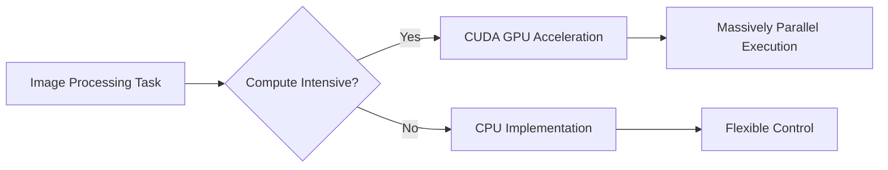
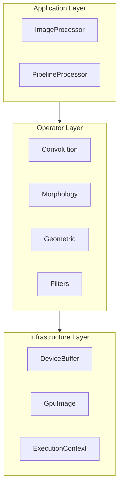

# Technical Whitepaper

This document provides a detailed overview of Mini-OpenCV's design philosophy, technology choices, and optimization strategies.

## Project Background

Mini-OpenCV is a CUDA image processing library that implements common computer vision operators as GPU kernels behind a three-layer C++17 architecture. It is a small, self-contained project; no comparative performance claims against CPU OpenCV are made here (see [Benchmarks](../benchmarks/) for what is actually measured). The project's design goals:

1. **GPU-Native Operators** - Implement common operators directly as CUDA kernels
2. **Clean API** - Modern C++17 interface design
3. **Easy Integration** - Usable as a dependency for GPU processing paths
4. **Testing** - GoogleTest unit tests plus a self-contained GPU latency benchmark

## Technology Stack

### Core Technologies

| Component | Version | Rationale |
|-----------|---------|-----------|
| C++ | 17 (host) | Modern C++ features: structured bindings, std::optional, if constexpr |
| CUDA | Toolkit 11.0+ | Device code is compiled as C++14; host code as C++17 |
| CMake | 3.18+ | Modern CMake: FetchContent, target-oriented build |
| GoogleTest | 1.14.0 | Industry-standard testing framework |
| Google Benchmark | 1.8.3 | Linked by the optional benchmark target (the current harness uses a custom std::chrono timer) |

### Why CUDA?

CUDA provides:
- **Massive Parallelism** - Thousands of threads executing simultaneously
- **Memory Hierarchy** - Global/Shared/Registers three-level memory
- **Specialized Hardware** - Texture units, Tensor Cores, etc. (not currently used by this project)

## Architecture Design

### Three-Layer Architecture

### Design Principles

1. **Separation of Concerns**
   - Application Layer: User API, workflow orchestration
   - Operator Layer: CUDA kernels, operator implementations
   - Infrastructure Layer: Memory management, error handling

2. **Zero-Overhead Abstraction**
   - Compile-time polymorphism (templates)
   - Inlined critical paths
   - Avoid virtual function calls

3. **Resource Management**
   - RAII memory management
   - Memory pool reuse
   - Pipeline async execution

## Performance Optimization Strategies

### CUDA Kernel Optimizations

Techniques actually implemented in the current codebase (no per-technique speedup figures are claimed; see [Benchmarks](../benchmarks/) for how to measure on your hardware):

| Technique | Description | Where |
|-----------|-------------|-------|
| Shared Memory Tiling | Cache input tile + halo in shared memory for data reuse | `convolution_engine.cu` |
| Vectorized Access | `uchar4` loads/stores for coalesced 4-byte access | `pixel_operator.cu` |
| Atomic Operations | `atomicAdd`-based histogram accumulation without a separate reduction | `histogram_calculator.cu` |

Warp primitives (`__shfl`, `__reduce`), texture memory, and loop unrolling pragmas are not used in the current kernels.

### Memory Optimization

1. **RAII Device Memory**
   - `DeviceBuffer` owns device allocations and frees them on destruction
   - No manual `cudaMalloc`/`cudaFree` bookkeeping in user code
   - Pinned/zero-copy host memory is not used; transfers are explicit uploads/downloads

2. **Memory Pool Reuse**
   - `ImageAllocator` can pool host image allocations (`ImageUtils::setMemoryPoolingEnabled`)
   - Reduces repeated allocation overhead
   - Minimizes fragmentation

### Asynchronous Execution

```mermaid
gantt
    title CUDA Streams Parallel Execution
    dateFormat X
    axisFormat %s
    
    section Stream 0
    Upload Image 1    :0, 1
    Gaussian Blur     :1, 2
    Download Result 1 :2, 3
    
    section Stream 1
    Upload Image 2    :0, 1
    Sobel Edge        :1, 2
    Download Result 2 :2, 3
```

## Relationship to Similar Projects

Mini-OpenCV is a small, self-contained project with a limited operator set. Mature libraries — OpenCV (including its `cv::cuda` C++ module and extensive test suite), CV-CUDA, and NPP — offer far broader operator coverage, production hardening, and years of optimization; they are the right choice for production workloads, and Mini-OpenCV does not claim to outperform them. Mini-OpenCV's value is a readable three-layer implementation of a core operator set with modern C++ RAII memory management, suitable for learning and for embedding where a minimal dependency footprint matters.

## Future Roadmap

1. **Tensor Core Support** - Leverage Tensor Cores for convolution acceleration
2. **Multi-GPU Support** - Cross-GPU load balancing
3. **Python Bindings** - Provide Python API
4. **More Operators** - Expand operator coverage

## References

See the [References](../references/) page for academic papers and related projects.
