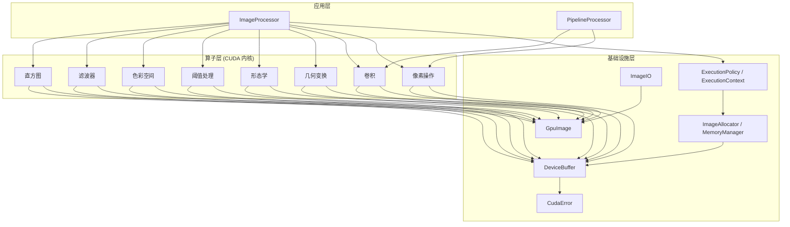
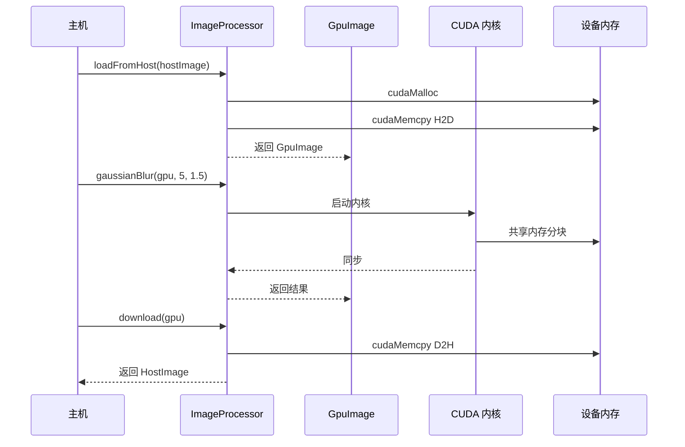
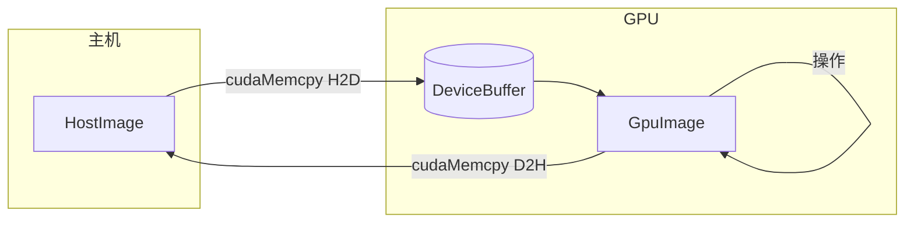

# 架构概览

Mini-OpenCV 采用**三层架构**设计，追求性能、模块化和易用性。

## 三层设计



## 层级职责

### 1. 应用层

用户交互的顶层 API：

| 组件 | 用途 |
|------|------|
| `ImageProcessor` | 图像操作的主入口（持有一个 `ExecutionContext`） |
| `PipelineProcessor` | 基于用户自定义步骤的多流批处理流水线（`addStep` + `processBatch`） |

### 2. 算子层

实现图像处理算法的 CUDA 内核。所有算子都是静态函数，并接受可选的 `cudaStream_t`：

| 类别 | 操作 | CUDA 技术 |
|------|------|-----------|
| **像素** | 反转、灰度、亮度 | 逐像素并行、`uchar4` 向量化 |
| **卷积** | 高斯模糊、Sobel、自定义核 | 共享内存分块 |
| **直方图** | 计算、均衡化 | 共享内存原子直方图 + 块间合并 |
| **几何** | 缩放、旋转、翻转、仿射 | 最近邻 / 双线性插值 |
| **形态学** | 腐蚀、膨胀、开闭运算 | 自定义结构元素 |
| **阈值** | 全局、自适应、Otsu | 直方图驱动 |
| **色彩空间** | RGB/HSV/YUV/Lab 转换 | 逐像素颜色变换 |
| **滤波** | 中值、双边、锐化 | 边缘保持滤波 |

### 3. 基础设施层

GPU 计算的核心工具：

| 组件 | 用途 |
|------|------|
| `DeviceBuffer` | RAII GPU 内存管理 |
| `GpuImage` / `HostImage` | 图像容器（设备端 / 主机端） |
| `ExecutionPolicy` / `ExecutionContext` | 封装 CUDA 流的同步 / 异步 / 批处理执行模型 |
| `ImageAllocator` / `MemoryManager` | 输出缓冲区分配，可选内存池 |
| `CudaError` | 错误处理（`CUDA_CHECK` 宏、`CudaException`） |
| `ImageIO` | 图像文件 I/O（基于 stb） |

## 执行模型

核心抽象是 `ExecutionContext`（`include/gpu_image/core/execution_context.hpp`）：

- **`ExecutionPolicy`** —— Sync、Async 或 Batch。Async/Batch 策略会创建并持有一个 `cudaStream_t`（`cudaStreamCreate`）；策略对象仅可移动（move-only），析构时销毁其流。
- **`ExecutionContext`** —— 包装执行策略，提供 `allocateOutput` / `ensureOutputSize` / `recycleToPool` / `synchronize` / `stream()`。
- **`ImageAllocator`** —— 上下文用于分配输出缓冲区的单例；内存池**默认关闭**。

```cpp
ExecutionContext ctx(ExecutionPolicy::async());
GpuImage output = ctx.allocateOutput(input);
PixelOperator::invert(input, output, ctx.stream());
ctx.synchronize();  // 仅异步/批处理模式需要
```

`ImageProcessor` 是由该上下文驱动的算子层门面；`PipelineProcessor` 则管理自己的流池用于批处理（见 [CUDA 流](./cuda-streams)）。

## 数据流



## 内存模型

### 主机–设备数据流



要点：

1. **RAII 缓冲区**: `DeviceBuffer` 自动释放设备内存；`GpuImage` 是持有缓冲区及 width/height/channels 的普通 struct
2. **可选内存池**: `MemoryManager` 按大小回收分配，由 `ImageAllocator` 控制开关——默认关闭
3. **多流批处理**: `PipelineProcessor` 通过 CUDA 流重叠传输与计算

## CUDA 流水线

`PipelineProcessor(numStreams)` 将图像轮流分配到各条流上，重叠每张图像的处理阶段：

```mermaid
gantt
    title 多流流水线执行
    dateFormat X
    axisFormat %s
    
    section 流 0
    H2D 传输 0    :0, 2
    内核 0        :2, 5
    D2H 传输 0    :5, 7
    
    section 流 1
    H2D 传输 1    :1, 3
    内核 1        :3, 6
    D2H 传输 1    :6, 8
    
    section 流 2
    H2D 传输 2    :2, 4
    内核 2        :4, 7
    D2H 传输 2    :7, 9
```



## 构建配置

主机代码按 **C++17** 编译，设备代码按 **C++14** 编译（`CMAKE_CXX_STANDARD 17`、`CMAKE_CUDA_STANDARD 14`）。

`CMAKE_CUDA_ARCHITECTURES` 默认为 `native`（CMake ≥ 3.24），回退值为 `75;80;86;89`：

| 架构 | 计算能力 | 示例 GPU |
|------|---------|----------|
| Turing | SM 75 | RTX 20 系列, T4 |
| Ampere | SM 80/86 | A100, RTX 30 系列 |
| Ada Lovelace | SM 89 | RTX 40 系列, L4 |

## 下一步

- [内存模型](./memory-model) - 深入了解 GPU 内存管理
- [CUDA 流](./cuda-streams) - 异步执行详情
- [设计决策](./design-decisions) - 架构决策记录
