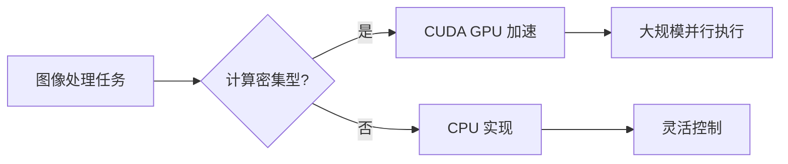
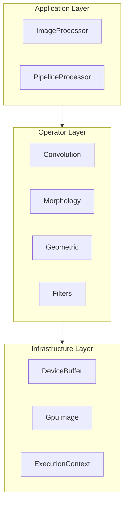

# 技术白皮书

本文档详细介绍 Mini-OpenCV 的设计理念、技术选型和优化策略。

## 项目背景

Mini-OpenCV 是一个 CUDA 图像处理库，以三层 C++17 架构将常见计算机视觉算子实现为 GPU 内核。它是一个小型、自包含的项目；本文不做任何相对 CPU OpenCV 的性能对比声明（实际测量内容见 [性能基准](../benchmarks/)）。项目的设计目标：

1. **GPU 原生算子** - 将常见算子直接实现为 CUDA 内核
2. **简洁 API** - C++17 现代化接口设计
3. **易于集成** - 可作为 GPU 处理路径的依赖引入
4. **测试** - GoogleTest 单元测试加自包含的 GPU 延迟基准测试

## 技术选型

### 核心技术栈

| 组件 | 版本 | 选型理由 |
|------|------|----------|
| C++ | 17（host） | 现代 C++ 特性：结构化绑定、std::optional、if constexpr |
| CUDA | Toolkit 11.0+ | 设备代码按 C++14 编译，主机代码按 C++17 编译 |
| CMake | 3.18+ | 现代 CMake：FetchContent、目标导向构建 |
| GoogleTest | 1.14.0 | 业界标准测试框架 |
| Google Benchmark | 1.8.3 | 由可选的基准测试目标链接（当前框架使用手写 std::chrono 计时器） |

### 为什么选择 CUDA？

CUDA 提供了：
- **大规模并行** - 数千个线程同时执行
- **内存层次** - Global/Shared/Registers 三级内存
- **专用硬件** - 纹理单元、Tensor Core 等（本项目当前未使用）

## 架构设计

### 三层架构

### 设计原则

1. **职责分离**
   - Application Layer：用户 API、工作流编排
   - Operator Layer：CUDA 内核、算子实现
   - Infrastructure Layer：内存管理、错误处理

2. **零开销抽象**
   - 编译期多态（模板）
   - 内联关键路径
   - 避免虚函数调用

3. **资源管理**
   - RAII 内存管理
   - 内存池复用
   - 流水线异步执行

## 性能优化策略

### CUDA 内核优化

当前代码中真实实现的技术（不声明逐项技术的加速比数字；如何在你的硬件上测量见 [性能基准](../benchmarks/)）：

| 技术 | 描述 | 位置 |
|------|------|------|
| Shared Memory Tiling | 将输入分块 + halo 缓存到共享内存以复用数据 | `convolution_engine.cu` |
| Vectorized Access | `uchar4` 读写，实现合并的 4 字节访问 | `pixel_operator.cu` |
| Atomic Operations | 基于 `atomicAdd` 的直方图累加，无需单独归约 | `histogram_calculator.cu` |

Warp 原语（`__shfl`、`__reduce`）、纹理内存和循环展开 pragma 在当前内核中均未使用。

### 内存优化

1. **RAII 设备内存**
   - `DeviceBuffer` 拥有设备分配并在析构时释放
   - 用户代码无需手动管理 `cudaMalloc`/`cudaFree`
   - 未使用 pinned/zero-copy 主机内存；传输为显式的上传/下载

2. **内存池复用**
   - `ImageAllocator` 可对主机图像分配进行池化（`ImageUtils::setMemoryPoolingEnabled`）
   - 减少重复分配开销
   - 碎片最小化

### 异步执行

```mermaid
gantt
    title CUDA Streams 并行执行
    dateFormat X
    axisFormat %s
    
    section Stream 0
    Upload Image 1    :0, 1
    Gaussian Blur     :1, 2
    Download Result 1 :2, 3
    
    section Stream 1
    Upload Image 2    :0, 1
    Sobel Edge        :1, 2
    Download Result 2 :2, 3
```

## 与同类项目的关系

Mini-OpenCV 是一个小型、自包含的项目，算子集合有限。成熟的库——OpenCV（含其 `cv::cuda` C++ 模块和庞大测试套件）、CV-CUDA、NPP——提供广得多的算子覆盖、生产级打磨和多年优化；生产负载应选择它们，Mini-OpenCV 也不声称性能超过它们。Mini-OpenCV 的价值在于：以现代 C++ RAII 内存管理，对核心算子集合做出可读的三层实现，适合学习，也适合嵌入到对依赖体积敏感的场景。

## 未来规划

1. **Tensor Core 支持** - 利用 Tensor Core 加速卷积
2. **多 GPU 支持** - 跨 GPU 负载均衡
3. **Python 绑定** - 提供 Python API
4. **更多算子** - 扩展算子覆盖范围

## 参考资料

详见 [学术引用](../references/) 页面。
